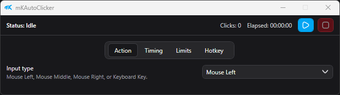
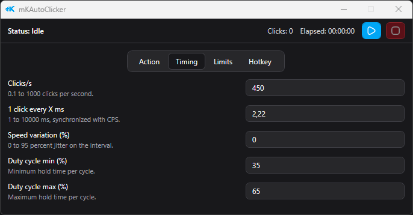
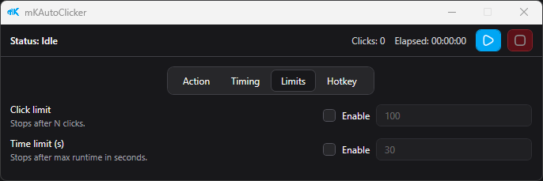
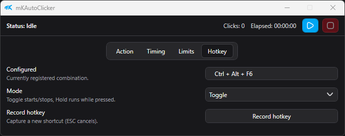

# mKAutoClicker

mKAutoClicker is a compact desktop autoclicker for Windows that can automate both mouse clicks and keyboard keys with precise timing and global hotkeys.

## What It Is For

- Repetitive mouse or keyboard actions
- Tool and workflow automation
- Fast start/stop control via global hotkeys
- Reliable timing control for both slow and very high-speed profiles

## What Makes It Different

Most autoclickers only support mouse input.  
mKAutoClicker supports keyboard key automation as a first-class feature:

- Any selectable virtual key
- Cleanly grouped key selection:
    - Alphabet (`A-Z`)
    - Numbers (`0-9`)
    - Function keys (`F1-F12`)
    - Numpad
    - Other keys

This makes it useful for scenarios where clickers are not enough and key input is required.

## Main Features

- Mouse actions: Left, Middle, Right
- Keyboard actions: configurable key press (`down` + `up`)
- Timing:
    - Clicks per second
    - 1 click every X ms
    - Bidirectional CPS/ms sync
    - Speed variation (%)
    - Duty cycle min/max (%)
- Optional stop conditions:
    - Click limit
    - Time limit
- Global hotkey modes:
    - Toggle
    - Hold
    - Hotkey recording
- Persistent settings between sessions

## Languages

mKAutoClicker currently supports:

- English
- German
- French
- Chinese (Simplified)

You can switch the language directly in the **Settings** tab.

## Screenshots

### Action

### Timing

### Limits

### Hotkey

## Quick Start

1. Download the latest `mkAutoClicker_<version>.exe` from Releases.
2. Select your action type (mouse or keyboard key).
3. Set speed and optional limits.
4. Configure your hotkey mode.
5. Start/stop directly in-app or with your global hotkey.

## Requirements

- Windows x64
- Installed .NET 8 Desktop Runtime
